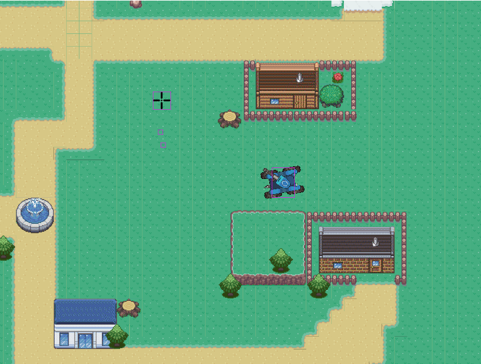
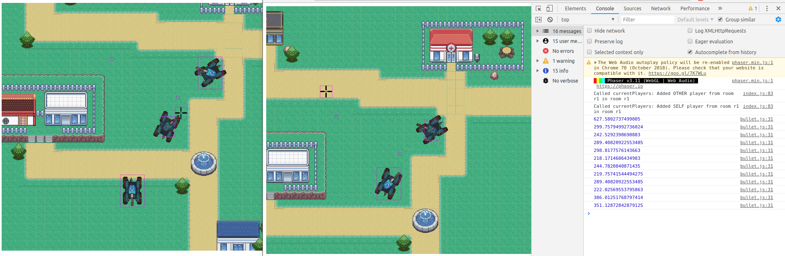

## Proiect Licenta - Tehnici Web

Pentru proiectul meu de licenta am ales sa creez un joc in browser folosind biblioteci si tehnici moderne pentru JavaScript. 

## Caracteristicile jocului
Am pornit la drum cu ideea de a crea un joc care poate fi jucat in orice browser, fara a fi nevoie ca utilizatorul sa instaleze software aditional pentru rularea acestuia. Mecanica principala a jocului consta intr-o lupta cu tancuri, 1 vs. 1, in timp real. Fiecare utilizator controleaza un tanc si trebuie sa il distruga pe cel al celuilalt utilizator pentru a inscrie puncte si a castiga meciul. Jocul se desfasoara intr-o perspectiva ortogonala 2D (in alte cuvinte campul de lupta si tancurile sunt vazute de sus, ca intr-un joc de strategie), iar tancurile se controleaza din tastele directionale. Turela lor se controleaza din mouse. Jocul se desfasoara in timp real deoarece fiecare utilizator vede ce face oponentul sau pe ecran. Comunicarea intre jucatori si coordonarea acestora se face cu ajutorul unui server. De asemenea, acest joc are si capacitatea de a gazduri meciuri intre mai multi utilizatori concomitent, cu posibilitatea izolarii actiunilor dintre un anumit meci de celelalte, dar toate gazduite pe acelasi server.

## Tehnologii folosite

 - JavaScript este principalul limbaj de programare.
 - [NodeJS](https://nodejs.org/en/) este un framework modern pentru JavaScript ce permite construirea de aplicatii in retea scalabile. Am ales acest framework deoarece are capacitatea de a gazdui multe conexiuni concomitente prin natura sa asincrona. Cu Node am creat partea de back-end, adica serverul.
 - [Express](https://expressjs.com/), care este la randul sau un framework peste NodeJS. Acesta este un framework minimal pentru creearea de aplicatii web folosit pentru servirea de continut static clientului si conectarea endpointurilor (URI-urilor) aplicatiei la cererile clientului (cererile HTTP de tipul GET/POST sunt tratate mult mai usor si rapid cu acesta).
 - [Phaser 3](https://phaser.io/phaser3) este o biblioteca pentru grafica si simularea fizica (coliziuni, particule, viteza, acceleratie a corpurilor) a elementelor de joc. Am ales sa folosesc aceasta biblioteca datorita caracterului modular care permite definirea de noi clase si extinderea celor existente in biblioteca foarte usor. Obiectele nou create sunt usor de manipulat avand o multitudine de metode utile, facandu-le astfel usor de separat pentru integrarea fiecareia in lumea jocului. Acest framework are in spate un renderer de WebGL, destinat special jocurilor 2D in browser.
- [Tiled](https://www.mapeditor.org/) este un editor de harti 2D ce faciliteaza creearea lumii de joc din seturi speciale de imagini numite [tilesets](https://www.mapeditor.org/img/screenshot-terrain.png) (seturi de dale individuale din care se construieste un nivel pentru joc).
- [MongoDB](https://www.mongodb.com/) pentru pastrarea datelor de autentificare ale utilizatorilor. Este un SGBD noSQL care mentine datele intr-un format flexibil JSON, iar modelul documentului se muleaza pe obiectele din codul aplicatiei, facand lucrurl cu aceasta foarte facil.
- HTML/CSS pentru aspectul paginilor web statice. Am folosit bootstrap care este o bibilioteca puternic bazata pe jQuery pentru a face un site web responsiv 
si cu un design simplu si placut.
- [PUG/Jade](https://pugjs.org/api/getting-started.html) care este un motor de templating pentru HTML, care in frameworkul Express este convertit automat si afisat ca HTML clasic. Folosing acest motor de templating se reduce codul rescris, iar lungimea acestuia este cu mult mai mica fata de HTML clasic deoarece elementele se declara doar o data si imbricarea acestora se face pe baza indentarii (asemanator de exemplu cu Python).
- [Passport.js](http://www.passportjs.org/) este un middleware pentru autentificare in Node si Express, alaturi de bcrypt, o bibilioteca pentru Node care face usoara criptarea parolelor.

## Imagini 
Prima imagine ofera o viziune de ansamblu asupra jocului. Se poate vedea un tanc, cu turela acestuia, nivelul in care sunt cateva casute si drumuri si tinta care semnifica in ce directie va trage turela.


A doua imagine arata cum in doua ferestre de browser diferite avem doua instante separate ale jocului. Fiecare jucator controleaza un tanc, iar actiunile fiecaruia sunt redate in timp real si pe ecranul celuilalt.

## Set-up
Pe Linux, trebuie ca inainte sa avem node si npm (managerul de pachete instalat): 
```bash
curl -sL https://deb.nodesource.com/setup_8.x | sudo -E bash -
sudo apt-get install -y nodejs
sudo apt-get install -y build-essential
```

Apoi creeam un nou director unde se cloneaza ce este pe github. npm va instala dependintele proiectului automat local. Daca nu functioneaza direct, incercati rularea `npm install -d` cu privilegii de administrator (`sudo`).
```bash
mkdir proiect && cd proiect
git clone --https://github.com/poptrb/jsgame
npm install -d
node server.js
intr-un browser intram in localhost:8081
```

Miscati tancul cu sagetile de pe tastatura. Din mouse se controleaza turela tancului. Click pentru a lansa o bomba. Daca mai deschideti o fereastra de browser la aceeasi adresa veti fi asignat unei camere din doar cele doua existente momentan in acest stadiu al jocului si veti vedea in timp real ceilalti jucatori (cati vedeti depinde in care din cele doua meciuri posibile ati fost plasati, pentru a reincerca dati refresh paginii). Proiectul are cateva bug-uri momentan (De exemplu se afiseaza un tanc in plus de fiecare data cand apare un nou jucator).
